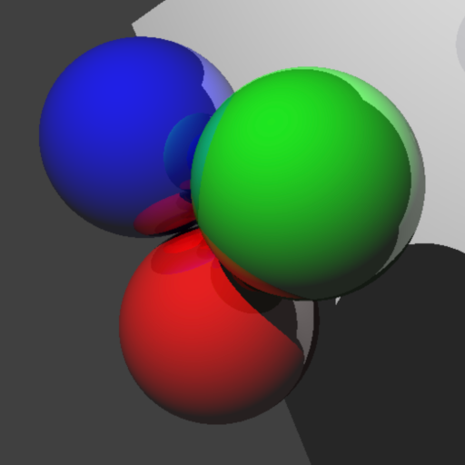

## アプリケーションの操作方法
### カメラの操作方法
キー操作は押下時・長押し時ともに連続入力に対応しており、移動や視点変更のレスポンスが高い。
画面端にカーソルを移動してもマウス入力が外れることなく、常に3D空間への操作が可能。
#### カメラ移動
- Wキー: 前へ進む
- Aキー: 左へ進む
- Sキー: 後ろへ進む
- Dキー: 右へ進む
- Rキー: 真上へ進む
- Fキー: 真下へ進む

#### カメラ回転
- 左側3D表示領域を左クリックしてドラッグすると、カメラの回転を行う。
- カメラの向きに合わせて、WASD+RFキーを押した時に移動する方向が変わり、ゲームのような直感的な操作を実現している。

### 操作パネル
#### 物体の追加
- ウィンドウ右上のComboBoxにて、物体の種類(立方体, 三角錐, 球, 光源)を選択する。
- テキストフィールドより座標を入力する。
- 大きさ/半径/明るさ を入力する(正の数のみ)。
- 物体の反射率(鏡面反射率)を入力する(0~1.0)。
- 色付きボタンを押すと別途色選択ウィンドウが開くので、そこで色を選択する。
- 「オブジェクトの追加」をクリックすると空間にオブジェクトが追加される。
- 入力値が間違っていた場合、「入力エラー」ダイアログが開く。

#### 物体の変更(編集)
本アプリケーションは、既存の物体の位置や大きさなどのプロパティを変更できる機能も有している。
- 右下のリストより、編集したい物体を選択する。
- 編集モードに切り替わるので、物体の追加と同様、ComboBoxから順にプロパティを入力する。
- 編集したい物体を選択すると、自動的にその物体のプロパティがテキストフィールドやComboBoxに反映される。
- 「変更を反映」をクリックする。

#### 物体の削除
- 右下のリストより、削除したい物体を選択する。
- 「選択したオブジェクトを削除」ボタンをクリックすると、物体が削除される。

#### 物体の全削除
- ウィンドウ右下、「すべて削除」ボタンをクリックすると、確認のダイアログが開く。
- 「はい」を選択すると、全ての物体が削除される。
- 完全に全ての物体が消えるわけではなく、起動直後と同様、光源は1つだけ追加されている状態となる。

#### 詳細操作
- メニューバー「編集」より詳細な操作がショートカットキーで可能
- 物体の移動
- 物体の拡大・縮小、または光源の明るさ変更
- 形状を変更
- 形状の色をランダムに変更
- カメラの位置、またはカメラの前方に入力座標を設定
- カメラの視点を水平に戻す

#### 設定
- メニューバー「ファイル」→「設定」をクリックすると、設定ウィンドウが開く。
- 最大フレームレートを5fps刻みで10~60の間で設定できる(初期値30)。
- レンダリング解像度を1/1~1/4の範囲で設定できる(初期値1/1)。これは、描画負荷を軽減する機能であり、1/4に設定した場合、ネイティブ解像度の1/4の解像度でレンダリングした後、ネイティブ解像度に映像を引き延ばす。ただし、画質は悪化する。
- 反射の最大深さを、0~127の間で設定できる(初期値10)。0にすると反射は初回のみとなる。127にすると1本のレイあたり最大127回の反射まで許容する。
- 背景色を設定できる。背景色は、物体の反射にも影響するため、背景色を変更すると見た目が大きく変化する。
- デバッグ情報の表示/非表示を変更できる。デバッグ情報とは、左上に表示されている、CPU使用率やカメラ座標などの情報である。
- これらの設定はアプリを閉じても保存される。

#### ベンチマーク機能
- 設定ウィンドウ下部、「ベンチマーク実行」ボタンをクリックするか、メニューバー「ベンチマーク」で開始できる。
- 球50個、三角錐20個、立方体20個、をそれぞれ20秒間ずつレンダリングし、フレーム数がそのままスコアとなる。
- ベンチマークスコアはアプリを閉じても保存される。
- 実際にCPUに依って性能差が生じる。
- ベンチマーク中は操作やボタン入力は不可能となり、ウィンドウサイズは強制的に変更される。
- レンダリング解像度等倍、反射の最大深さ127の最重量級の設定でレンダリングが行われる。

#### シーン保存
- メニューバー「ファイル」よりシーンの保存や読み込みができる。
- 上書き保存に対応している。
- ショートカットキーで簡単に保存できる。

#### 初期化
- メニューバー「ファイル」→「保存されたデータを初期化」より、設定を初期状態に戻し、ベンチマークスコアを全てリセットする。
- 確認ダイアログが表示され、誤って押しても引き返せる設計となっている。

### 描画パネル
#### レンダリング
- 設定したフレームレートでレンダリングを試みる。
- 非常に高負荷なため、ノートPCでの長時間動作は非推奨である。
- 本アプリへのフォーカスが途切れると、自動的にレンダリングを停止する。
- ⌥option + Pでもレンダリングの停止・再開が可能
#### デバッグ情報
- フレームレート、CPU使用率、論理コア数、メモリ使用量やカメラの位置などの情報を表示する。
- CPU使用率はシステム全体の使用率である。
- メモリ使用量は[本アプリが実際に使用中のメモリ/JVMに割り当てられているメモリ]の形式で表示される。
